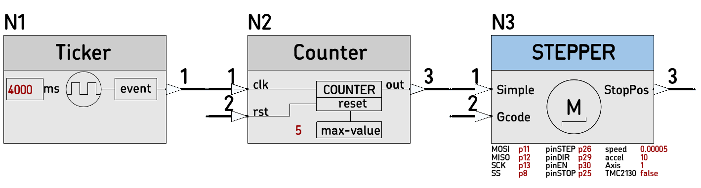
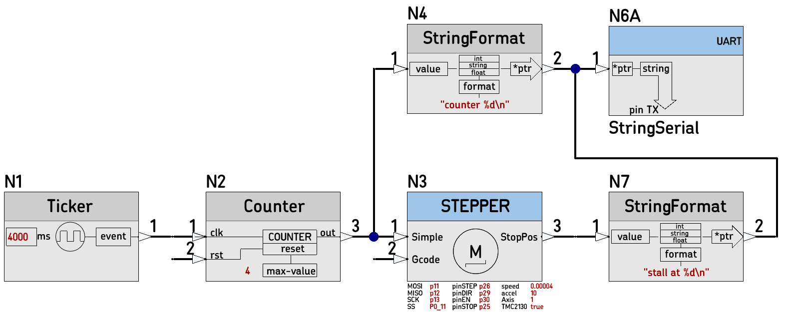
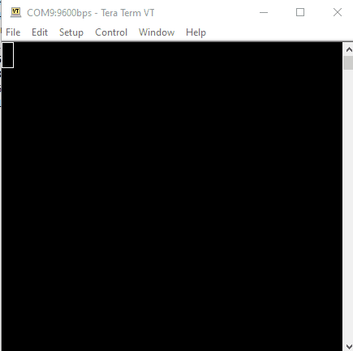
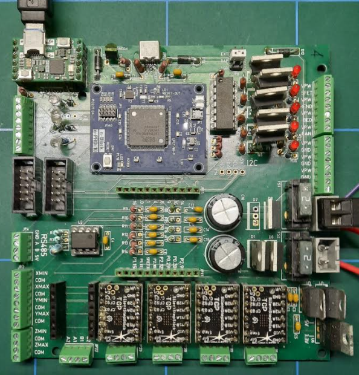

# [26D_STEPPER_test](https://github.com/nBlocksStudioApps/26D_STEPPER_test_FIRMWARE.git)

C++ project created automatically from the [26D_STEPPER_test schematic design](https://github.com/nBlocksStudioApps/26D_STEPPER_test),
to test and fine tune the new Node [STEPPER](https://github.com/nBlocksStudioNodes/nblocks_stepper)

## Schematic Design

## Motion examples

## Stall detection

## Testing boards
 *  n-PRO-3DP motion control motherboard 
 *  n-PRO-10 LPC1768
 *  n-DAP mbed-enable agent
 *  TCM2100 silentstepstick

